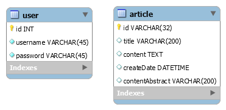

# PigWrite
> 这是一个简单的博客系统

## 1. 设计思路
系统架构经典的B/S架构作为基础架构，使用Linux作为Service操作系统，所以主要的核心程序需要运行于Linux操作系统上。程序的编写和编译在Windows上完成。系统的数据持久化方案使用轻量级的MySQL作为数据库，使用Hibernate框架来屏蔽原生JDBC带来的复杂性。安全控制使用Spring框架提供的简单的Security组件完成。对用户来说，系统提供网页GUI界面接口来使用系统。

## 1. 涉及技术内容
1. Linux操作系统
2. MySQL数据库应用
3. SpringMVC、Spring、Hibernate
4. HTML/CSS/JavaScript
5. Vue.js
6. ElementUI
7. Maven、Webpack
    
## 2. 数据库设计
1. 
2. 该系统涉及到两个基本表，分别为关于用户信息的 `user` 表，一个是关于博客内容的 `article` 表，两个基本表之间并无直接关联，因为系统只有一个
用户。不需要将文章和用户之间建立关联关系。
3. 表字段说明：
    * `user` 表
    
    |字段名|说明|
    |---|---|
    |id(INT)|用户系统id|
    |username(VARCHAR)|用户名称|
    |password(VARCHAR)|用户密码|
    
    * `article` 表
    
    |字段名|说明|
    |---|---|
    |id(VARCHAR)|使用哈希算法算出的系统唯一识别号|
    |title(VARCHAR)|文章标题|
    |content(TEXT)|文章内容|
    |createDate(DATETIME)|文章创建时间|
    |contentAbstract(VARCHAR)|文章摘要|
     
## 3. 程序获取及编译部署运行方式
1. 获取
> 该项目源代码托管地址：[传送门](https://github.com/MonkeyAndDog/PigWriterServers)
```
git clone git@github.com:MonkeyAndDog/pigwriter.git
```

2. 配置编译
    * 添加配置文件
        ```
        # 在src/main/resources目录下添加 key.properties 配置文件，内容像下面这样
        #   jdbc.driverClassName=com.mysql.jdbc.Driver
        #   jdbc.url=jdbc:mysql://localhost:3306/pigwriter
        #   jdbc.username=***
        #   jdbc.password=***
        ```
    * 编译
        ```
        mvn clean
        mvn package
        ```
3. 将得到的.war文件放置于Linux服务器中，启动服务器。
